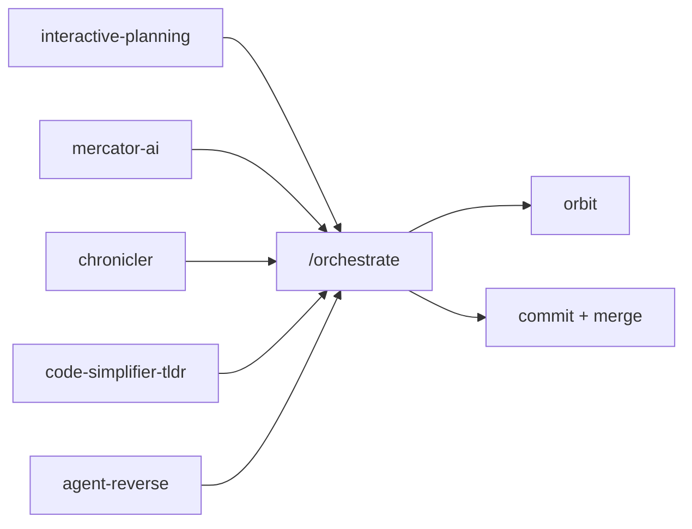

# shihwesley-plugins

A personal collection of Claude Code plugins built to sharpen AI-assisted development — better codebase understanding, tighter context windows, structured workflows, and faster research loops.

Seven plugins across three categories, each solving a specific friction point in agent-driven development. Together, they compose into an automated orchestration pipeline that takes a plan from outline to committed code.

## Install

```bash
/plugin marketplace add shihwesley/shihwesley-plugins
```

Then install individual plugins as needed (see tables below).

## Plugins

### Codebase Intelligence

Help your AI agent understand, map, and efficiently consume codebases.

| Plugin | What it does | Install |
|--------|-------------|---------|
| [**mercator-ai**](https://github.com/shihwesley/mercator-ai) | Merkle-enhanced codebase mapping with O(1) change detection | `/plugin install mercator-ai@shihwesley-plugins` |
| [**chronicler**](https://github.com/shihwesley/chronicler) | Ambient `.tech.md` generation with freshness tracking | `/plugin install chronicler@shihwesley-plugins` |
| [**code-simplifier-tldr**](https://github.com/shihwesley/code-simplifier-tldr) | AST-based code summarization — 80%+ token savings | `/plugin install code-simplifier-tldr@shihwesley-plugins` |

- **mercator-ai** — Generates `CODEBASE_MAP.md` with file purposes, architecture layers, and dependency graphs. Uses a merkle manifest (`docs/.mercator.json`) so re-runs only re-analyze changed files instead of rescanning everything.
- **chronicler** — Watches your source files and auto-generates `.tech.md` docs alongside them. Tracks freshness per file — flags stale docs when the source changes, so documentation stays current without manual upkeep. Reads mercator-ai's merkle manifest to know which files changed, so it only regenerates docs for what's actually different.
- **code-simplifier-tldr** — Parses source into AST summaries (function signatures, class shapes, key types) and caches them. Agents read summaries for context and only pull full source when they need to edit. Integrates with mercator-ai's merkle tree for O(1) cache invalidation — only re-parses files whose hash changed. Cuts 80%+ of token usage on large codebases.

### Workflow & Environment

Structure your planning process and manage runtime environments without manual switching.

| Plugin | What it does | Install |
|--------|-------------|---------|
| [**interactive-planning**](https://github.com/shihwesley/interactive-planning) | File-based planning with interactive gates and task tracking | `/plugin install interactive-planning@shihwesley-plugins` |
| [**orbit**](https://github.com/shihwesley/Orbit) | Ambient dev environment management — auto-switches dev/test/staging/prod via Docker | `/plugin install orbit@shihwesley-plugins` |

- **interactive-planning** — Combines Manus-style file-based planning with spec-driven multi-file architecture. In task mode, it creates a single `task_plan.md` with phases and dependencies. In spec mode, it generates a manifest with separate spec files per component. Uses `AskUserQuestion` at interactive gates to pause and get user input at key decision points — prevents agents from charging ahead on the wrong path.
- **orbit** — Classifies what you're doing (running tests, debugging, deploying) and auto-switches the right Docker environment. Manages container lifecycle, sidecars, and port mapping across dev/test/staging/prod so you never run tests against the wrong database.

### Research & Extraction

Sandboxed experimentation and capability extraction from external sources.

| Plugin | What it does | Install |
|--------|-------------|---------|
| [**rlm-sandbox**](https://github.com/shihwesley/rlm-sandbox) | Docker sandbox for Python/DSPy + memvid knowledge store (16 MCP tools) | `/plugin install rlm-sandbox@shihwesley-plugins` |
| [**agent-reverse**](https://github.com/shihwesley/agent-reverse) | Reverse engineer capabilities from repos, configs, articles into your workflow | `/plugin install agent-reverse@shihwesley-plugins` |

- **rlm-sandbox** — Spins up an isolated Docker container with Python, DSPy, and a memvid-backed knowledge store. Exposes 16 MCP tools for code execution, sub-agent orchestration, session persistence, and research automation — all sandboxed so nothing touches your host machine.
- **agent-reverse** — Point it at a GitHub repo, local config, binary, or article and it extracts capabilities, patterns, and skills into your agent workflow. Includes security scanning, manifest tracking, and cross-agent restore so you can port setups between machines.

### Orchestration (preview)

`/orchestrate` is an automated pipeline that chains these plugins into a single execution flow. It takes output from `/interactive-planning` and runs it through plan review, skill matching, worktree isolation, parallel agent dispatch, testing, code review, and incremental commits — hands-off from plan to merged code.

Not yet packaged as a standalone plugin. Currently runs as a personal workflow on top of the installed plugins above. The plan is to ship it once the remaining dependencies (code-review, commit-split) are also pluginized.

[Full pipeline breakdown](docs/orchestrate-workflow.md)

## How They Work Together

These plugins aren't just a collection — they compose into a pipeline. The orchestrator consumes output from each plugin at different stages:



| Pipeline Stage | What happens | Plugins used |
|---------------|-------------|--------------|
| **Plan** | User creates phased plan with tasks, specs, and dependencies | interactive-planning |
| **Ingest** | Reads plan + project context (codebase map, tech docs, AST summaries) | mercator-ai, chronicler, code-simplifier-tldr |
| **Match** | Finds the right skills and agent types for each phase | agent-reverse |
| **Research** | Fetches official docs for unfamiliar tech before agents write code | Context7 / web search |
| **Gate** | Shows full execution plan, gets user approval before touching code | — |
| **Execute** | Creates git worktree per phase, dispatches 2-3 agents in parallel | — |
| **Test** | Runs tests in an isolated environment per phase | orbit |
| **Review** | Automated code review, auto-fixes critical issues | code-review (coming soon) |
| **Commit** | Incremental commits per phase, merge back to feature branch | commit-split (coming soon) |

Stages marked "coming soon" work today as personal skills — they'll become installable plugins in a future release.

## Update

```bash
/plugin marketplace update shihwesley-plugins
```

Individual plugins version independently. Push a fix to a plugin's repo and users pick it up on their next marketplace update — no changes needed here.

## License

MIT
