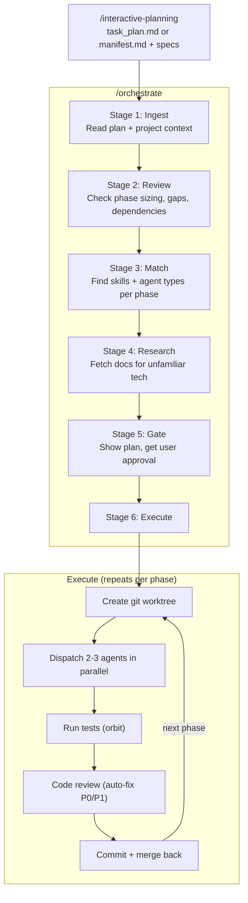

# The Orchestrate Pipeline

`/orchestrate` is an automated execution engine that takes a plan (from `/interactive-planning`) and turns it into committed, tested, reviewed code — without manual intervention between stages.

It chains together several plugins from this marketplace, personal skills, and MCP servers into a six-stage pipeline. Each stage has a specific job and clear inputs/outputs.

## Pipeline at a Glance



## Stage-by-Stage Breakdown

### Stage 1: Ingest

Reads the plan files and project context. Supports two plan formats:

- **Task-based** — a single `task_plan.md` with phases and tasks
- **Spec-driven** — a `manifest.md` pointing to individual spec files under `docs/plans/specs/`

Also reads project docs to give agents context:

| Source | Plugin | What it provides |
|--------|--------|-----------------|
| `docs/CODEBASE_MAP.md` | mercator-ai | File purposes, architecture layers, dependency graph |
| `.chronicler/` tech docs | chronicler | Per-file documentation, freshness status |
| `.tldr/` AST summaries | code-simplifier-tldr | Function signatures, class shapes — agents read these instead of full source |
| `CLAUDE.md` files | (project convention) | Build commands, style rules, project-specific instructions |

The TLDR summaries matter here. Without them, agents would read full source files to get context, burning through the context window. With TLDR, they read compact summaries and only pull full source for files they need to edit.

### Stage 2: Review

A Plan-type agent reviews each phase for problems:

- **Sizing** — phases with >5 tasks or >3 modules get split
- **Gaps** — missing setup, migration, test, or doc phases get inserted
- **Clarity** — vague tasks get enriched with specific file targets from CODEBASE_MAP
- **Dependencies** — validates ordering, finds phases that can run in parallel
- **Confidence** — scores each phase high/medium/low

Output: a revised phase manifest with a change summary explaining what was modified and why.

Skipped on `--resume` (the plan was already reviewed on the first run).

### Stage 3: Match Skills

For each phase, the orchestrator finds the best skills and agent type:

1. **Registry lookup** — checks a local `skill-registry.json` that maps keywords (languages, domains, file extensions) to skills and agent types
2. **agent-reverse fallback** — if no registry match, queries the agent-reverse MCP server for suggestions. If it finds something, installs the skill permanently.
3. **Web search fallback** — searches for Claude Code skills on GitHub. If found, uses agent-reverse to analyze and install.
4. **Final fallback** — `general-purpose` agent type (always works, not specialized)

This is where agent-reverse earns its keep. A plan that mentions "GRDB" or "SwiftUI" or "FastAPI" gets matched to specialized skills that know those APIs, instead of a generic agent guessing at method signatures.

### Stage 4: Research

Before agents write any code, the orchestrator fetches official documentation for every technology in the plan. This is the anti-hallucination layer.

For each technology:
1. Check local cache (`.claude/docs/{tech}/`) — skip if fresh
2. Check if a matched skill already covers it — skip (the skill IS the docs)
3. Try Context7 (MCP-based doc fetcher) — returns structured API references
4. Fall back to web search + WebFetch

Output: cheat sheets per technology, stored at `.claude/docs/{tech}/cheat-sheet.md`. These get injected into agent prompts during execution so agents have real API signatures instead of training-data memories.

### Stage 5: Gate

Presents the full execution plan to the user:

- Phase execution table (title, task count, agent type, skills, confidence)
- Dispatch mode (Agent Teams or classic subagents)
- Config (max parallel agents, test/review strategy)
- Research summary (which tech was cached, fetched, or already known)

The user can: execute all phases, execute a specific phase, adjust the plan, or do a dry-run.

Nothing changes until the user approves.

### Stage 6: Execute

For each phase, sequentially:

**6a. Worktree** — Creates an isolated git worktree (`../project-phase-N`) on a dedicated branch (`orchestrate/phase-N-slug`). All agent work happens here, not on the main branch.

**6b. Dispatch** — Sends 2-3 agents in parallel, each with:
- Their specific task from the plan
- The worktree path
- Matched skills from Stage 3
- Cheat sheets from Stage 4
- Project conventions from CLAUDE.md

Two dispatch modes:
- **Classic** — fire-and-forget Task agents, batched and awaited
- **Agent Teams** — a team lead coordinates teammates with shared task lists and inter-agent messaging (experimental, requires `CLAUDE_CODE_EXPERIMENTAL_AGENT_TEAMS=1`)

**6c. Test** — Runs `/orbit test` in the worktree. Orbit auto-selects the right environment (test containers, databases, sidecars). If tests fail, a fix agent gets dispatched with the failure output. Max 2 retries before asking the user.

**6d. Review** — Runs code review against uncommitted changes. P0/P1 issues trigger an auto-fix agent. P2/P3 get logged as follow-ups. Max 1 retry for critical issues.

**6e. Commit** — Stages changes, commits with a structured message (`orchestrate(phase-N): title`), and merges back to the feature branch with `--no-ff`.

**6f. Cleanup** — Removes the worktree, deletes the phase branch, updates `progress.md` with results (test counts, review findings, commit hash, duration). Proceeds to next phase.

## Resume Support

If orchestration gets interrupted (context window limit, crash, `/clear`):

```bash
/orchestrate --resume ./plans/my-feature
```

Resume is context-efficient:
- TLDR-scans `progress.md` for the table of contents instead of reading the full file
- Reads only pending phases from the plan (not completed ones)
- Skips Stage 2 (review) entirely — the plan was already reviewed
- For spec-driven plans: reads just the manifest + the single next spec file (~110-140 lines total vs ~300-500 for task-based)

Git log cross-references completed specs against actual commits, so even if `progress.md` is stale (crash before write), the orchestrator can recover state from commit messages.

## Plugin Dependency Map

| Plugin | Stage | Required? | What happens without it |
|--------|-------|-----------|------------------------|
| interactive-planning | Input | Yes | No plan to execute |
| mercator-ai | Ingest | No | Agents lack codebase map — they explore blind |
| chronicler | Ingest | No | Agents lack per-file docs — they read more source |
| code-simplifier-tldr | Ingest | No | Agents read full source for context — higher token usage |
| agent-reverse | Match | No | All phases use `general-purpose` agent type |
| orbit | Test | No | Test stage skipped — no automated testing |
| code-review (planned) | Review | No | Review stage skipped — no automated review |
| commit-split (planned) | Commit | No | Single commit per phase instead of logical splits |

The orchestrator degrades gracefully. With zero plugins installed, it still dispatches agents and commits code — you just lose the context enrichment, skill matching, isolated testing, and automated review.

## Flags

| Flag | Default | What it does |
|------|---------|-------------|
| `--dry-run` | off | Runs Stages 1-4, shows what would happen, makes no changes |
| `--resume` | off | Picks up from last completed phase |
| `--max-parallel N` | 3 | Max agents per batch |
| `--model sonnet\|opus\|haiku` | sonnet | Model for dispatched agents |
| `--phase N` | all | Execute only phase N |
| `--team` | auto | Force Agent Teams mode |
| `--no-team` | auto | Force classic Task-based dispatch |

## Status

`/orchestrate` runs as a personal workflow today — a command file + 8 supporting skills in the user's `.claude/` directory. It works, but it's not portable.

**What blocks pluginization:**
- code-review and commit-split aren't plugins yet (personal skills)
- Claude Code's plugin system doesn't support dependency declarations between plugins
- The skill registry is personalized (maps to locally installed skills)

**Path forward:** pluginize code-review and commit-split as standalone plugins first, then package orchestrate as the capstone that ties the ecosystem together. Each piece is useful on its own; orchestrate is the automation layer that chains them.
